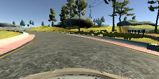
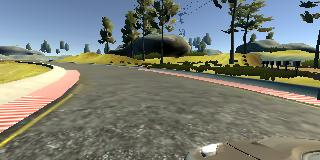
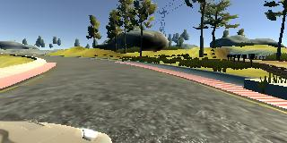
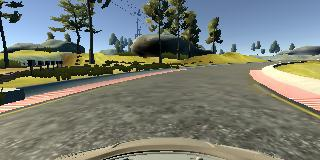
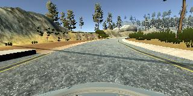
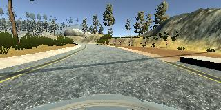
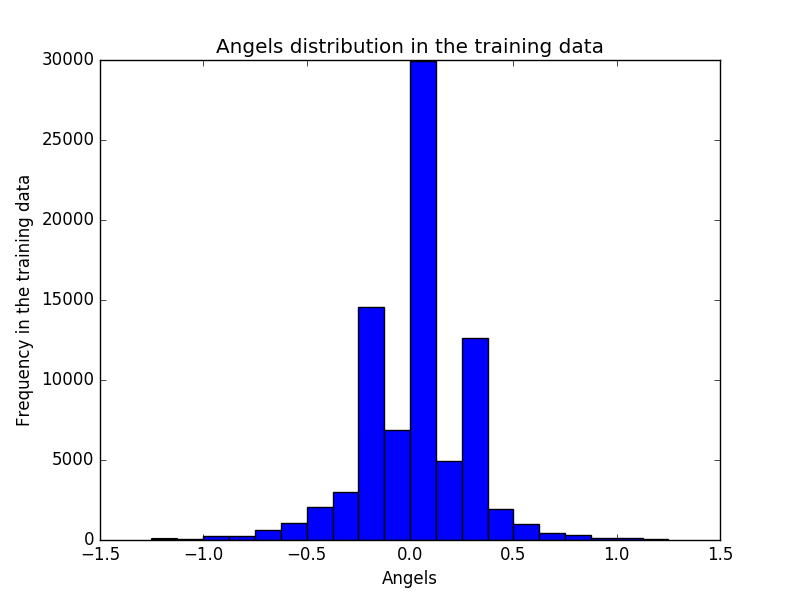

Clone driving behaviour using Deep Learning
===

In this project, a simulator (analog not keyboard -- Dominique) is used to get images (CENTER, LEFT and RIGHT) and steering angle while driving in track 1. Around 22k images from each angle is collected (~66k).
This data is then preprocessed and fed into convolutional neural network to train it.
The model is then used to predict the streering angle given an image so that it can drive the car in an autonomous fashion around the track.

## Preprocessing and Data Augmentation
The driving log csv is read and is shuffled.
For each line in the driving log:

1. The center image is added to the data
2. Left image and the steering angle is adjusted by adding 0.25 to the steering angle
3. Right image and the streering angle is adjusted by subtracted 0.25 from the steering angle
4. Center image is mirrored and -1 is multiplied by the streering angle and then added

For each image, the following is the preprocessing pipeline:

1. 10 pixels is cropped from the y space as this area contain mostly trees, green area which is noise for this problem.
2. The image is resized from 160x320x3 to 20x64x3
3. Then the image value is normalized by diving over 255.0 and subtracting 0.5 from the result

The model is then trained with this data using a generator which reads one line from the CSV and apply what we just described on the fly, this way we can train huge data sets without going out of memory.

##Model Architecture

The model I chose to train the data was one that is based on [Nvidia end to end learning for self driving cars](http://images.nvidia.com/content/tegra/automotive/images/2016/solutions/pdf/end-to-end-dl-using-px.pdf).
The model have 5 conv layers then fully connected layers (with one less layer).
The model has a dropout in order to prevent overfitting.

The following is the model used:

| Layer (type)                                     | Output Shape                     | Param # |
| ------------------------------------------------ |:--------------------------------:|:-------:|
| batchnormalization_1 (BatchNormalization)        | (None, 20, 64, 3)                | 80     |
| convolution2d_1 (Convolution2D)                  | (None, 9, 31, 16)                | 448     |
| convolution2d_2 (Convolution2D)                  | (None, 7, 15, 24)                | 3480    |
| convolution2d_3 (Convolution2D)                  | (None, 5, 13, 36)                | 7812    |
| convolution2d_4 (Convolution2D)                  | (None, 4, 12, 48)                | 6960    |
| convolution2d_5 (Convolution2D)                  | (None, 3, 11, 48)                | 9264    |
| flatten_1 (Flatten)                              | (None, 1584)                     | 0       |
| dense_1 (Dense)                                  | (None, 512)                      | 811520  |
| dropout_1 (Dropout)                              | (None, 512)                      | 0       |
| activation_1 (Activation)                        | (None, 512)                      | 0       |
| dense_2 (Dense)                                  | (None, 10)                       | 5130    |
| activation_2 (Activation)                        | (None, 10)                       | 0       |
| dense_3 (Dense)                                  | (None, 1)                        | 11      |

Adam optimizer has been used with MSE. 25 Epochs has been used in training.

I have iterated on this model by training the same data for the same number of epochs with less conv layers and fully connected layer in the beginning, then I started to add more conv layers and fully connected layers in a fashion that resembles the nvidia model.
I noticed that that the autonomous driving was better by adding those layers until I reached the model above which seemed to show the best results.

##Data
Training has been done using both the digital and analog simulator, with a total of ~6 laps in the first track, while trying to stay in the middle of the road as much as possible.
The digital simulator outputs 3 images (CENTER, LEFT and RIGHT).
Here is an example of a CENTER image and it's steering of -0.2781274:

The following is the corresponding LEFT image and it's adjusted steering (add 0.25) of -0.0281274:

The following is the corresponding RIGHT image and it's adjusted steering (add -0.25) of -0.5281274:

The following is the center image flipped with it's adjusted steering (multiply -1) of 0.2781274:

While the analog simulator outputs only 1 image (CENTER).

The following is an example of a CENTER image and it's steering of 0:

The following is an example of a CENTER image flipped and it's adjusted steering (multiply -1) of 0:

Each image is preprocessed:

1. Crop 10 pixels (remove trees, etc.. which are mainly noise)
2. Image is resized from 160x320x3 to 20x64x3
3. The image value is normalized by dividing over 255.0 and subtracting 0.5 from the result

The following shows the center image before and after the preprocessing:

Before preprocessing:

After preprocessing:

While iterating on the model, initially the car would drive off the road right after the bridge as seen in the following video:

In order to correct that, I positioned the car in the same orientation and location and turned the wheel toward the middle of the road while the car was standing the then started recording.
I did this numerous times and then I retrained the model and that corrected the issue and then the car now would stay on the road.

I went over all the angels from the data, and created this histogram which shows the distribution of the angels:

####Successful run track 1

One of the important lessons I learned was the importance of clean data in large quantities to train the model so that it can effectively clone the behaviour.
The cleaner and the more the data, the better the model was at predicting.
