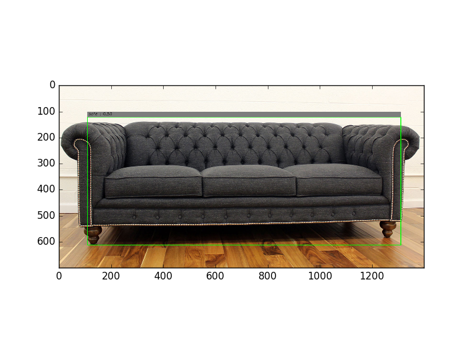

Object detection using YOLO
===

## Installation and running
Installation:

1. mkdir weights/
2. Get the weight from https://drive.google.com/file/d/0B2JbaJSrWLpza0FtQlc3ejhMTTA/view?usp=sharing and place it under weights/

To run: yolo.py --type=image --input=image_path

## Pipeline
The YOLO pipeline is as follows:

1. Build the model. The following is the model used is the following model:

| Layer (type)                                     | Size                     |
| ------------------------------------------------ |:------------------------:|
| Convolution                                      | 16x3x3x3                 |
| Max Pooling                                      | 2x2                      |
| Convolution                                      | 32x3x3x3                 |
| Max Pooling                                      | 2x2                      |
| Convolution                                      | 64x3x3x3                 |
| Max Pooling                                      | 2x2                      |
| Convolution                                      | 128x3x3x3                |
| Max Pooling                                      | 2x2                      |
| Convolution                                      | 256x3x3x3                |
| Max Pooling                                      | 2x2                      |
| Convolution                                      | 512x3x3x3                |
| Max Pooling                                      | 2x2                      |
| Convolution                                      | 1024x3x3x3               |
| Convolution                                      | 1024x3x3x3               |
| Convolution                                      | 1024x3x3x3               |
| Fully Connected                                  | 256                      |
| Fully Connected                                  | 4096                     |
| Fully Connected                                  | 1470                     |

2. Load the weights as the model have already been trained to assign it to the layers.
3. Load the image, resize it into (448, 448).
4. Convert it from BGR to BRG.
5. Normalize it by dividing over 255.0, multiplying by 2.0 and subtracting 1.0
6. Feed that into the model.
7. Take the result from 0 to 980 as the class probabilities. We have 20 classes.
8. Filter out of that those that are less than the threshold (currently set to 0.2).
9. Take the result from 980 to 1078 as the scales of the boxes.
10. Take the result from 1078 to 1470 as the boxes.

## Object Detection
The following image shows a sofa being detected:

The following image shows another sofa being detected:

The following image shows a person being detected:

##Credits
This project is to learn more about object detection using [YOLO](https://ai2-website.s3.amazonaws.com/publications/YOLO.pdf).
The work here is inspired from [here](https://github.com/gliese581gg/YOLO_tensorflow).
